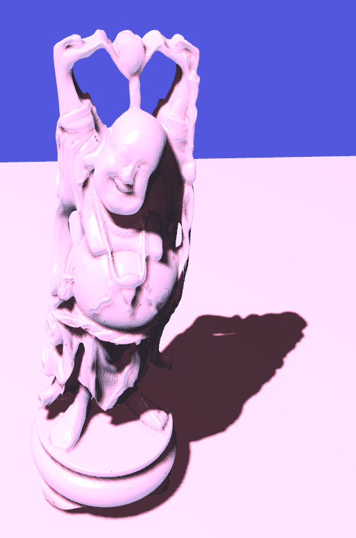

# Shadow Mapping Sample

Simple PCF shadow mapping example using
[TensorViz](https://gitlab.com/mipl/3d-reconstruction/tensorviz).



Thanks to [Joey de
Vries](https://learnopengl.com/Advanced-Lighting/Shadows/Shadow-Mapping)
for bias and PCF explanation.

## Run using Docker

The script [`tv-try`](tv-try) launches a docker image containg all dependencies of TensorViz.

```shell
shadow-mapping$ ./tv-try demo.py <input-object>
```

Or use the rule `docker-demo-buddha` from the Makefile.

```shell
shadow-mapping$ make docker-demo-buddha
```

## Run using the source code.

Install TensorViz into your environment following the instructions on
its [repository](https://gitlab.com/mipl/3d-reconstruction/tensorviz).

Run the rule `demo-buddha-highres`, to download the Buddha from the
[Standord 3D Scanning
Repository](http://graphics.stanford.edu/data/3Dscanrep/) and run the
demo.

```shell
$ make demo-budha-highres
```

